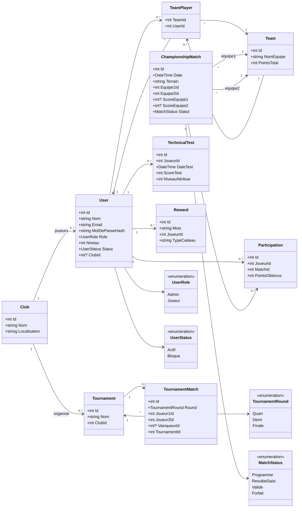
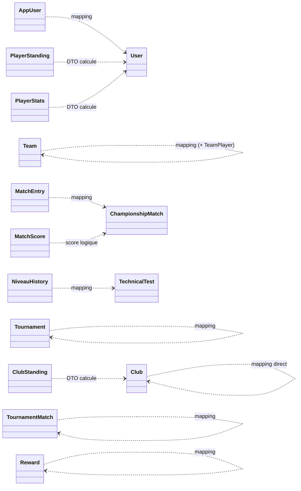

# Diagramme de Classe - Championnat Padel

Ce document contient une version de travail du diagramme de classe, derivee directement des classes du projet.

## 1) Domaine Backend (source de verite metier)

## 2) Mapping Flutter <-> Backend

Ce schema montre comment les modeles Flutter representent les entites backend.

## 3) Fichiers de reference

- Backend entites: backend/PadelChampionship.Api/Models/Entities.cs
- Backend enums: backend/PadelChampionship.Api/Models/Enums.cs
- Relations EF Core: backend/PadelChampionship.Api/Data/ApplicationDbContext.cs
- Modeles Flutter: lib/domain/models/

## 4) Pistes d'amelioration

- Ajouter les DTOs (CreatePlayerDto, ScoreDto, etc.) si vous voulez un diagramme technique API.
- Ajouter les services (AuthService, PlayersService, ...) si vous voulez un diagramme d'architecture objet.
- Transformer TeamPlayer en relation n-n explicite au niveau frontend (pas seulement List<int> playerIds).
