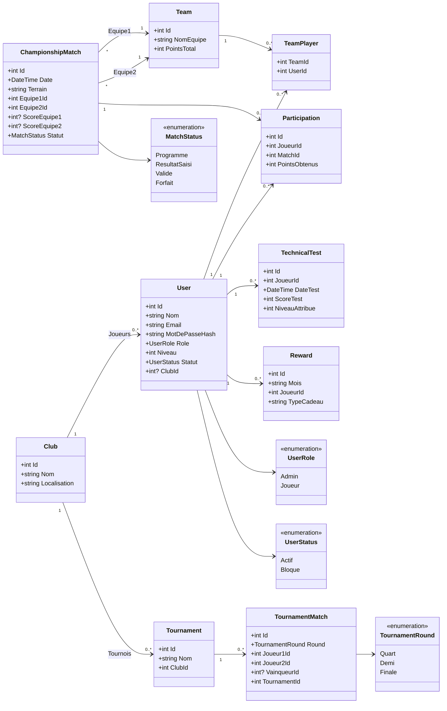
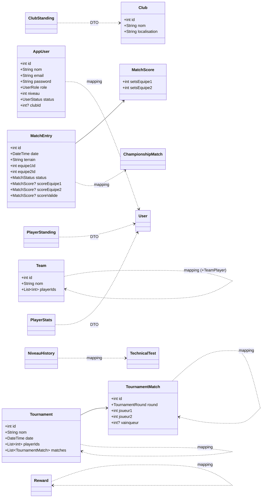

# Diagramme de classe corrige (100% aligne au code)

Ce document est strictement base sur les classes existantes dans le projet.
Il ne contient pas de classes conceptuelles ajoutees.

## 1) Domaine backend exact

Source: backend/PadelChampionship.Api/Models/Entities.cs

## 2) Mapping Flutter exact

Source: lib/domain/models/

## 3) Ce qui a ete retire car absent du code actuel

- InscriptionTournoi
- SaisieResultat
- ResultatValide
- AttributionPoints
- ClassementGeneral et LigneClassementGeneral
- ClassementMensuel et LigneClassementMensuel

Ces concepts existent dans la logique metier, mais ne sont pas modeles comme classes autonomes dans les fichiers actuels.
