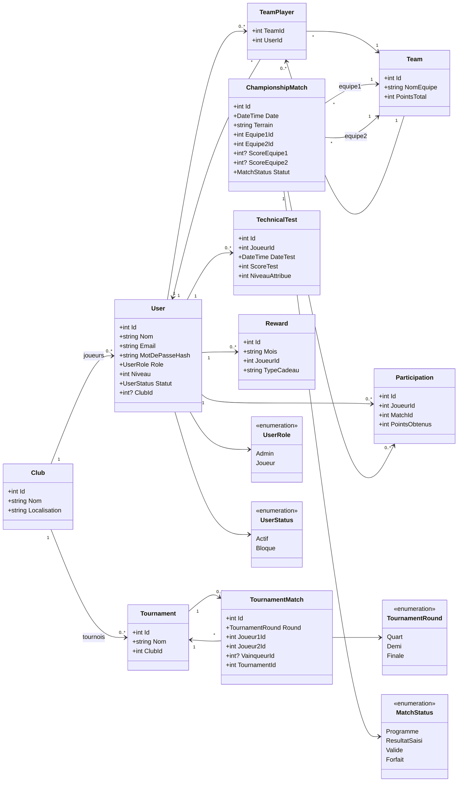

# Diagramme de classe complet (version finale)

Ce diagramme est complet et aligne sur les classes reelles du projet.

```mermaid
classDiagram
  direction LR

  class User {
    +int Id
    +string Nom
    +string Email
    +string MotDePasseHash
    +UserRole Role
    +int Niveau
    +UserStatus Statut
    +int? ClubId
  }

  class Club {
    +int Id
    +string Nom
    +string Localisation
  }

  class Team {
    +int Id
    +string NomEquipe
    +int PointsTotal
  }

  class TeamPlayer {
    +int TeamId
    +int UserId
  }

  class ChampionshipMatch {
    +int Id
    +DateTime Date
    +string Terrain
    +int Equipe1Id
    +int Equipe2Id
    +int? ScoreEquipe1
    +int? ScoreEquipe2
    +MatchStatus Statut
  }

  class Participation {
    +int Id
    +int JoueurId
    +int MatchId
    +int PointsObtenus
  }

  class TechnicalTest {
    +int Id
    +int JoueurId
    +DateTime DateTest
    +int ScoreTest
    +int NiveauAttribue
  }

  class Reward {
    +int Id
    +string Mois
    +int JoueurId
    +string TypeCadeau
  }

  class Tournament {
    +int Id
    +string Nom
    +int ClubId
  }

  class TournamentMatch {
    +int Id
    +TournamentRound Round
    +int Joueur1Id
    +int Joueur2Id
    +int? VainqueurId
    +int TournamentId
  }

  class UserRole {
    <<enumeration>>
    Admin
    Joueur
  }

  class UserStatus {
    <<enumeration>>
    Actif
    Bloque
  }

  class MatchStatus {
    <<enumeration>>
    Programme
    ResultatSaisi
    Valide
    Forfait
  }

  class TournamentRound {
    <<enumeration>>
    Quart
    Demi
    Finale
  }

  Club "1" --> "0..*" User : joueurs
  Club "1" --> "0..*" Tournament : tournois

  Team "1" --> "0..*" TeamPlayer
  User "1" --> "0..*" TeamPlayer

  TeamPlayer "*" --> "1" Team
  TeamPlayer "*" --> "1" User

  ChampionshipMatch "*" --> "1" Team : equipe1
  ChampionshipMatch "*" --> "1" Team : equipe2

  User "1" --> "0..*" Participation
  ChampionshipMatch "1" --> "0..*" Participation

  User "1" --> "0..*" TechnicalTest
  User "1" --> "0..*" Reward

  Tournament "1" --> "0..*" TournamentMatch
  TournamentMatch "*" --> "1" Tournament

  User --> UserRole
  User --> UserStatus
  ChampionshipMatch --> MatchStatus
  TournamentMatch --> TournamentRound
```
